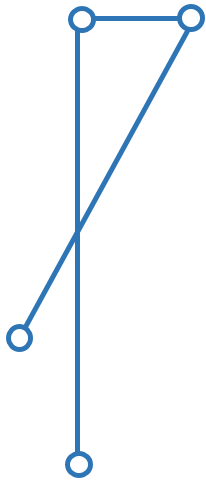
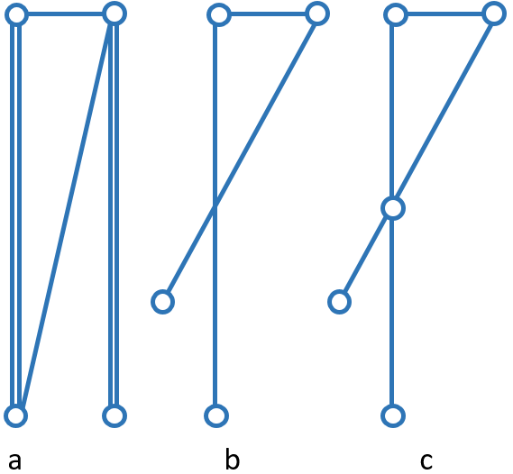

# Datenbereich: Attribute

## Regel Attribute
|ID|RAt
|:--|:--
|**Bezeichnung**|**Attribute**
|**Beschreibung**|Für die Validierung der Attributen gelten die im **[[1]](#1-kogis-interlis-2--referenzhandbuch-13042006)** Kap. 3.3.11 definierten Regeln</td>
|**Details**|<ul><li>Der Wert ```%AttributeName%``` muss der ```AttributeDef``` ( **[[1]](#1-kogis-interlis-2--referenzhandbuch-13042006)** Kap. 2.6) im INTERLIS-Datenmodell entsprechen</li><li>Der Attributtyp und der Attributwert des Werts ```AttributeValue``` müssen der ```AttrTypeDef``` ( **[[1]](#1-kogis-interlis-2--referenzhandbuch-13042006)** Kap. 2.6 und 2.8) im INTERLIS-Datenmodell entsprechen</li><li>Bei Attributen von Typ ```NAME``` kommt die Regel *Namen* ( **[[1]](#1-kogis-interlis-2--referenzhandbuch-13042006)** Kap. 2.2.2) zur Anwendung. Namen, die mit reservierten Wörtern der Sprache ( **[[1]](#1-kogis-interlis-2--referenzhandbuch-13042006)** Kap. 2.2.7) zusammenfallen, sind unzulässig</li></ul>
|**Referenz**|**[[1]](#1-kogis-interlis-2--referenzhandbuch-13042006)** Kap. 2.2.2, 2.2.7, 2.6, 2.8 und 3.3.11

### Testfälle
###### Attribute - RAt.T01
|ID|RAt.T01
|:--|:--
|**Bezeichnung**|```AttributeName```
|**Beschreibung**|Der Test muss prüfen, ob der Wert ```%AttributeName%``` der Definition im INTERLIS-Datenmodell entspricht
|**Testvoraussetzung**|RAt.T01a.xtf, *TestSuite.ili*
|**Erwartetes Ergebnis**|<ul><li>RAt.T01a.xtf: Fehlermeldung. Wert ```%AttributeName%``` stimmt nicht</li></ul>
|**Referenz**| **[[1]](#1-kogis-interlis-2--referenzhandbuch-13042006)** Kap. 2.6 und 3.3.11

###### Attribute - RAt.T02
|ID|RAt.T02
|:--|:--
|**Bezeichnung**|```TEXT```
|**Beschreibung**|Die Tests müssen prüfen, ob der Attributwert der Definition im INTERLIS-Datenmodell für ```TEXT```, bzw. den entsprechenden Codierungsregeln, entspricht
|**Testvoraussetzung**|RAt.T02a.xtf, RAt.T02b.xtf, RAt.T02c.xtf, RAt.T02d.xtf, *TestSuite.ili*
|**Erwartetes Ergebnis**|<ul><li>RAt.T02a.xtf: Fehlermeldung. Wert ist leer</li><li>RAt.T02b.xtf: keine Fehlermeldung. Leerzeichen sind gültige Zeichen</li><li>RAt.T02c.xtf: Fehlermeldung. Attribut ```Art3``` muss auf drei Zeichen begrenzt werden</li><li>RAt.T02d.xtf: Fehlermeldung. ```TEXT``` muss als einzeiliger Text codiert werden: Steuerzeichen sind nicht zulässig</li></ul>
|**Referenz**|**[[1]](#1-kogis-interlis-2--referenzhandbuch-13042006)** Kap. 2.6, 2.8.1 und 3.3.11.2<br/>**[[2]](bib.md#2-w3c-extensible-markup-language-xml-10-fifth-edition-26112008)** Kap. 2.2 (https://www.w3.org/TR/REC-xml/#charsets)

###### Attribute - RAt.T03
|ID|RAt.T03
|:--|:--
|**Bezeichnung**|```MTEXT```
|**Beschreibung**|Die Tests müssen prüfen, ob der Attributwert der Definition im INTERLIS-Datenmodell für ```MTEXT```, bzw. den entsprechenden Codierungsregeln, entspricht
|**Testvoraussetzung**|RAt.T03a.xtf, RAt.T03b.xtf, *TestSuite.ili*
|**Erwartetes Ergebnis**|<ul><li>RAt.T03a.xtf: Fehlermeldung. Attribut ```Beschreibung``` muss auf 9 Zeichen begrenzt werden. Jeder Wagenrücklauf zählt als 1 Zeichen</li><li>RAt.T03b.xtf: keine Fehlermeldung. Steuerzeichen, wie Tabulatoren, sind in ```MTEXT``` zulässig</li></ul>
|**Referenz**|**[[1]](#1-kogis-interlis-2--referenzhandbuch-13042006)** Kap. 2.6, 2.8.1 und 3.3.11.2<br/>**[[2]](bib.md#2-w3c-extensible-markup-language-xml-10-fifth-edition-26112008)** Kap. 2.11 (https://www.w3.org/TR/REC-xml/#sec-line-ends)<br/>**[[2]](bib.md#2-w3c-extensible-markup-language-xml-10-fifth-edition-26112008)** Kap. 2.2 (https://www.w3.org/TR/REC-xml/#charsets)

###### Attribute - RAt.T04
|ID|RAt.T04
|:--|:--
|**Bezeichnung**|```NAME```
|**Beschreibung**|Die Tests müssen prüfen, ob der Attributwert der Definition im INTERLIS-Datenmodell für ```NAME```, bzw. den entsprechenden Codierungsregeln, entspricht
|**Testvoraussetzung**|RAt.T04a.xtf, RAt.T04b.xtf, RAt.T04c.xtf, *TestSuite.ili*
|**Erwartetes Ergebnis**|<ul><li>RAt.T04a.xtf: Fehlermeldung. ```NAME``` ist eine Folge von maximal 255 Buchstaben</li><li>RAt.T04b.xtf: Fehlermeldung. Das erste Zeichen muss ein Buchstabe sein</li><li>RAt.T04c.xtf: Fehlermeldung. Bei Namen sind reservierte INTERLIS-Wörter unzulässig</li></ul>
|**Referenz**|**[[1]](#1-kogis-interlis-2--referenzhandbuch-13042006)** Kap. 2.2.2, 2.2.7, 2.6, 2.8.1 und 3.3.11.2<br/>**[[2]](bib.md#2-w3c-extensible-markup-language-xml-10-fifth-edition-26112008)** Kap. 2.3 (https://www.w3.org/TR/REC-xml/#NT-Name)

###### Attribute - RAt.T05
|ID|RAt.T05
|:--|:--
|**Bezeichnung**|```URI```
|**Beschreibung**|Die Tests müssen prüfen, ob der Attributwert der Definition im INTERLIS-Datenmodell für ```URI```, bzw. den entsprechenden Codierungsregeln, entspricht
|**Testvoraussetzung**|RAt.T05a.xtf, RAt.T05b.xtf, *TestSuite.ili*
|**Erwartetes Ergebnis**|<ul><li>RAt.T05a.xtf: Fehlermeldung. ```URI``` ist eine Folge von maximal 1023 Buchstaben</li><li>RAt.T05b.xtf: Fehlermeldung. Fehlendes URI-Schema</li></ul>
|**Referenz**|**[[1]](#1-kogis-interlis-2--referenzhandbuch-13042006)** Kap. 2.6, 2.8.1 und 3.3.11.2<br/>**[[3]](bib.md#3-ietf-rfc-uniform-resource-identifiers-uri-generic-syntax-08-1998)** Kap. 3

###### Attribute - RAt.T06
|ID|RAt.T06
|:--|:--
|**Bezeichnung**|```EnumerationType```
|**Beschreibung**|Die Tests müssen prüfen, ob der Attributwert der Definition im INTERLIS-Datenmodell für ```EnumerationType```, bzw. den entsprechenden Codierungsregeln, entspricht
|**Testvoraussetzung**|RAt.T06a.xtf, RAt.T06b.xtf, *TestSuite.ili*
|**Erwartetes Ergebnis**|<ul><li>RAt.T06a.xtf: Fehlermeldung. Die Werte einer Aufzählung sind *case-sensitive*</li><li>RAt.T06b.xtf: Fehlermeldung. Die Blätter des Baumes (nicht aber die Knoten) bilden die Menge der zulässigen Werte: ```Gebaeude``` ist ein Knoten.</li></ul>
|**Referenz**|**[[1]](#1-kogis-interlis-2--referenzhandbuch-13042006)** Kap. 2.6, 2.8.2 und 3.3.11.3

###### Attribute - RAt.T07
|ID|RAt.T07
|:--|:--
|**Bezeichnung**|```EnumTreeValueType```
|**Beschreibung**|Die Tests müssen prüfen, ob der Attributwert der Definition im INTERLIS-Datenmodell für ```EnumTreeValueType```, bzw. den entsprechenden Codierungsregeln, entspricht
|**Testvoraussetzung**|RAt.T07a.xtf, RAt.T07b.xtf, *TestSuite.ili*
|**Erwartetes Ergebnis**|<ul><li>RAt.T07a.xtf: Fehlermeldung. Unzulässiger Wert ```dunkel```)</li><li>RAt.T07b.xtf: keine Fehlermeldung. Blätter und Knoten sind zulässig</li></ul>
|**Referenz**|**[[1]](#1-kogis-interlis-2--referenzhandbuch-13042006)** Kap. 2.6, 2.8.2 und 3.3.11.3

###### Attribute - RAt.T08
|ID|RAt.T08
|:--|:--
|**Bezeichnung**|```BooleanType```
|**Beschreibung**|Die Tests müssen prüfen, ob der Attributwert der Definition im INTERLIS-Datenmodell für ```BooleanType```, bzw. den entsprechenden Codierungsregeln, entspricht
|**Testvoraussetzung**|RAt.T08a.xtf, RAt.T08b.xtf, *TestSuite.ili*
|**Erwartetes Ergebnis**|<ul><li>RAt.T08a.xtf: keine Fehlermeldung.</li><li>RAt.T08b.xtf: Fehlermeldung. Unzulässiger Wert (```0```)</li></ul>
|**Referenz**|**[[1]](#1-kogis-interlis-2--referenzhandbuch-13042006)** Kap. 2.6, 2.8.4 und 3.3.11

###### Attribute - RAt.T09
|ID|RAt.T10
|:--|:--
|**Bezeichnung**|```NumericType```
|**Beschreibung**|Die Tests müssen prüfen, ob der Attributwert der Definition im INTERLIS-Datenmodell für ```NumericType```, bzw. den entsprechenden Codierungsregeln, entspricht
|**Testvoraussetzung**|RAt.T09a.xtf, RAt.T09b.xtf, RAt.T09c.xtf, RAt.T09d.xtf, *TestSuite.ili*
|**Erwartetes Ergebnis**|<ul><li>RAt.T09a.xtf: keine Fehlermeldung.</li><li>RAt.T09b.xtf: Fehlermeldung. Unzulässiger Wert (```0.9(```)</li><li>RAt.T09c.xtf: keine Fehlermeldung</li><li>RAt.T09d.xtf: Fehlermeldung ((```00004(``` statt (```4(```)</li></ul>
|**Referenz**|**[[1]](#1-kogis-interlis-2--referenzhandbuch-13042006)** Kap. 2.6, 2.8.5 und 3.3.11.4

###### Attribute - RAt.T10
|ID|RAt.T10
|:--|:--
|**Bezeichnung**|```FormattedType```
|**Beschreibung**|Die Tests müssen prüfen, ob der Attributwert der Definition im INTERLIS-Datenmodell für ```FormattedType```, bzw. den entsprechenden Codierungsregeln, entspricht
|**Testvoraussetzung**|RAt.T10a.xtf, RAt.T10b.xtf, *TestSuite.ili*
|**Erwartetes Ergebnis**|<ul><li>RAt.T10a.xtf: Fehlermeldung. Unzulässiger Wert (```1```)</li><li>RAt.T10b.xtf: Fehlermeldung. Unzulässiges Jahr (```3000```)</li></ul>
|**Referenz**|**[[1]](#1-kogis-interlis-2--referenzhandbuch-13042006)** Kap. 2.6, 2.8.6, 2.8.7 und 3.3.11.5

###### Attribute - RAt.T11
|ID|RAt.T11
|:--|:--
|**Bezeichnung**|```OIDType```
|**Beschreibung**|Die Tests müssen prüfen, ob der Attributwert der Definition im INTERLIS-Datenmodell für ```OIDType```, bzw. den entsprechenden Codierungsregeln, entspricht
|**Testvoraussetzung**|RAt.T11a.xtf, RAt.T11b.xtf, RAt.T11c.xtf, RAt.T11d.xtf, *TestSuite.ili*
|**Erwartetes Ergebnis**|<ul><li>RAt.T11a.xtf: Fehlermeldung. Ungültiger UUID im ```BID```</li><li>RAt.T11b.xtf: Fehlermeldung. Ungültiger UUID im ```TID```</li><li>RAt.T11c.xtf: keine Fehlermeldung</li><li>RAt.T11d.xtf: Fehlermeldung. Ungültige Codierung (muss als XML-Attribut codiert werden)</li><li>RAt.T11e.xtf: Fehlermeldung. Nur Ziffern und Buchstaben erlaubt</li><li>RAt.T11f.xtf: Fehlermeldung. Erstes Zeichen muss Buchstabe oder Unterstrich sein</li></ul>
|**Referenz**|**[[1]](#1-kogis-interlis-2--referenzhandbuch-13042006)** Kap. 2.8.9 und 3.3.11.16<br/> **[[4]](bib.md#4-w3c-xmlid-version-10-09-09-2005-online-available-httpswwww3orgtrxml-id)** Kap. D.2 (https://www.w3.org/TR/xml-id/#id-avn)

## Regel Struktur- und Referenzattribute
|ID|RStReA
|:--|:--
|**Bezeichnung**|**Struktur- und Referenzattribute **
|**Beschreibung**|Für die Validierung von Struktur- und Referenzattributen gelten die im **[[1]](#1-kogis-interlis-2--referenzhandbuch-13042006)** Kap. 3.3.11.9, bzw. Kap. 3.3.11.14, definierten Regeln
|**Details**|<ul><li>Die Angaben müssen der ```AttrTypeDef``` ( **[[1]](#1-kogis-interlis-2--referenzhandbuch-13042006)** Kap. 2.6) im INTERLIS-Datenmodell entsprechen</li></ul>
|**Referenz**|**[[1]](#1-kogis-interlis-2--referenzhandbuch-13042006)** Kap. 2.6.3, 2.6.4, 3.3.11.9 und 3.3.11.14

### Testfälle
###### Struktur- und Referenzattribute - RStReA.T01
|ID|RStReA.T01
|:--|:--
|**Bezeichnung**|```StructureValue```
|**Beschreibung**|Die Tests müssen prüfen, ob der Strukturattribut der ```StructureDef``` im INTERLIS-Datenmodell, bzw. den entsprechenden Codierungsregeln für den ```StructureValue```, entspricht
|**Testvoraussetzung**|RStReA.T01a.xtf, RStReA.T01b.xtf, *TestSuite.ili*
|**Erwartetes Ergebnis**|<ul><li>RStReA.T01a.xtf: keine Fehlermeldung</li><li>RStReA.T01b.xtf: Fehlermeldung: falsche Codierung</li></ul>
|**Referenz**|**[[1]](#1-kogis-interlis-2--referenzhandbuch-13042006)** Kap. 2.6.4 und 3.3.11.9

###### Struktur- und Referenzattribute - RStReA.T02
|ID|RStReA.T02
|:--|:--
|**Bezeichnung**|```ReferenceAttribute```
|**Beschreibung**|Die Tests müssen prüfen, ob der Referenzattribut der Definition im INTERLIS-Datenmodell, bzw. den entsprechenden Codierungsregeln, entspricht
|**Testvoraussetzung**|RStReA.T02a.xtf, RStReA.T02b.xtf, RStReA.T02c.xtf, *TestSuite.ili*
|**Erwartetes Ergebnis**|<ul><li>RStReA.T02a.xtf: keine Fehlermeldung</li><li>RStReA.T02b.xtf: keine Fehlermeldung</li><li>RStReA.T02c.xtf: keine Fehlermeldung</li></ul>
|**Referenz**|**[[1]](#1-kogis-interlis-2--referenzhandbuch-13042006)** Kap. 2.6.3 und 3.3.11.14

## Regel Koordinaten
|ID|RCO
|:--|:--
|**Bezeichnung**|```COORD```
|**Beschreibung**|Für die Validierung der Attributwerten von Typ ```COORD``` gelten die im **[[1]](#1-kogis-interlis-2--referenzhandbuch-13042006)** Kap. 3.3.11.11 definierten Regeln
|**Details**|<ul><li>Angaben in ```CoordValue``` müssen der ```AttrTypeDef``` ( **[[1]](#1-kogis-interlis-2--referenzhandbuch-13042006)** Kap. 2.6 und 2.8.8) im INTERLIS-Datenmodell entsprechen</li></ul>
|**Referenz**|**[[1]](#1-kogis-interlis-2--referenzhandbuch-13042006)** Kap. 2.6, 2.8.8 und 3.3.11.11

### Testfälle
###### Koordinaten - RCO.T01
|ID|RCO.T01
|:--|:--
|**Bezeichnung**|```COORD```
|**Beschreibung**|Der Test muss prüfen, ob die Koordinaten vorhanden sind
|**Testvoraussetzung**|RCO.T01a.xtf, *TestSuite.ili*
|**Erwartetes Ergebnis**|<ul><li>RCO.T01a.xtf: Fehlermeldung. Koordinaten nicht vorhanden</li></ul>
|**Referenz**| **[[1]](#1-kogis-interlis-2--referenzhandbuch-13042006)** Kap. 2.8.8 und 3.3.11.11

###### Koordinaten - RCO.T02
|ID|RCO.T02
|:--|:--
|**Bezeichnung**|```COORD```: **Codierung**
|**Beschreibung**|Die Tests müssen prüfen, ob die Koordinaten den Codierungsregeln entsprechen
|**Testvoraussetzung**|RCO.T02a.xtf, RCO.T02b.xtf, *TestSuite.ili*
|**Erwartetes Ergebnis**|<ul><li>RCO.T02a.xtf: Fehlermeldung. Falsche Codierung (```<C4>```)</li><li>RCO.T02b.xtf: Fehlermeldung. Redundante Koordinaten(```<C2>```)</li></ul>
|**Referenz**|**[[1]](#1-kogis-interlis-2--referenzhandbuch-13042006)** Kap. 2.8.8 und 3.3.11.11

###### Koordinaten - RCO.T03
|ID|RCO.T03
|:--|:--
|**Bezeichnung**|```COORD```: **Wertbereich**
|**Beschreibung**|Die Tests müssen prüfen, ob die Koordinaten der Definition im INTERLIS-Datenmodell entsprechen
|**Testvoraussetzung**|RCO.T03a.xtf, RCO.T03b.xtf, *TestSuite.ili*
|**Erwartetes Ergebnis**|<ul><li>RCO.T03a.xtf: Fehlermeldung. ```<C2>``` nicht im Wertbereich</li><li>RCO.T03b.xtf: Fehlermeldung. ```<C3>``` nicht erlaubt, weil Wertbereich für 2D-Koordinaten ist</li></ul>
|**Referenz**|**[[1]](#1-kogis-interlis-2--referenzhandbuch-13042006)** Kap. 2.8.8 und 3.3.11.11

## Regel Linienzüge
|ID|RPO
|:--|:--
|**Bezeichnung**|```POLYLINE```
|**Beschreibung**|Für die Validierung der Attributwerten von Typ ```POLYLINE``` gelten die im **[[1]](#1-kogis-interlis-2--referenzhandbuch-13042006)** Kap. 3.3.11.12 definierten Regeln
|**Details**|<ul><li>Angaben in ```PolylineValue``` müssen der ```AttrTypeDef``` ( **[[1]](#1-kogis-interlis-2--referenzhandbuch-13042006)** Kap. 2.6 und 2.8.12.2) im INTERLIS-Datenmodell entsprechen</li><li>Für die Validierung der Geometrie eines Linienzugs gelten zusätzlich die im **[[1]](#1-kogis-interlis-2--referenzhandbuch-13042006)** Kap. 2.8.12 definierten Regeln</li></ul>
|**Referenz**|**[[1]](#1-kogis-interlis-2--referenzhandbuch-13042006)** Kap. 2.6, 2.8.12, 2.8.12.2 und 3.3.11.12

### Testfälle
###### Linienzüge - RPO.T01
|ID|RPO.T01
|:--|:--
|**Bezeichnung**|```POLYLINE```: **Linienzug**
|**Beschreibung**|Der Test muss die Validität eines Linienzugs prüfen
|**Testvoraussetzung**|RPO.T01a.xtf, *TestSuite.ili*
|**Beispiel**|<p align="center"><br/>```POLYLINE WITH (STRAIGHTS, ARCS) VERTEX LKoord;```
|**Erwartetes Ergebnis**|<ul><li>RPO.T01a.xtf: keine Fehlermeldung</li></ul>
|**Referenz**|**[[1]](#1-kogis-interlis-2--referenzhandbuch-13042006)** Kap. 2.8.12 und 3.3.11.12

###### Linienzüge - RPO.T02
|ID|RPO.T02
|:--|:--
|**Bezeichnung**|```POLYLINE```: **einfacher Linienzug**
|**Beschreibung**|Die Tests müssen die Validität eines einfachen Linienzugs prüfen (**[[1]](#1-kogis-interlis-2--referenzhandbuch-13042006)** Kap. 2.8.12.2, Regel ```WITHOUT OVERLAPS```)
|**Testvoraussetzung**|RPO.T02a.xtf, RPO.T02b.xtf, RPO.T02c.xtf, *TestSuite.ili*
|**Beispiel**|<p align="center"><br/>```POLYLINE WITH (STRAIGHTS, ARCS) VERTEX LKoord WITHOUT OVERLAPS > 1;```
|**Erwartetes Ergebnis**|<ul><li>RPO.T02a.xtf: Fehlermeldung, weil Selbstüberschneidung und Kurvenstücke mehrmals benutzt</li><li>RPO.T02b.xtf: Fehlermeldung, weil Selbstüberschneidung</li><li>RPO.T02c.xtf: keine Fehlermeldung</li></ul>
|**Referenz**|**[[1]](#1-kogis-interlis-2--referenzhandbuch-13042006)** Kap. 2.8.12.2 und 3.3.11.12

###### Linienzüge - RPO.T03
|ID|RPO.T03
|:--|:--
|**Bezeichnung**|**Toleranz bei ARC**
|**Beschreibung**|Die Tests müssen die Toleranz prüfen (**[[1]](#1-kogis-interlis-2--referenzhandbuch-13042006)** Kap. 2.8.12.2, Regel ```WITHOUT OVERLAPS > 1;```)
|**Testvoraussetzung**|RPO.T03a.xtf, RPO.T03b.xtf, *TestSuite.ili*
|**Beispiel**|<p align="center"><br/>```POLYLINE WITH (STRAIGHTS, ARCS) VERTEX LKoord WITHOUT OVERLAPS > 0.10;```
|**Erwartetes Ergebnis**|<ul><li>RPO.T01a.xtf: keine Fehlermeldung</li></ul>
|**Referenz**|**[[1]](#1-kogis-interlis-2--referenzhandbuch-13042006)** Kap. 2.8.12 und 3.3.11.12

## Regel Einzelflächen und Gebietseinteilungen
|ID|RSU
|:--|:--
|**Bezeichnung**|```SURFACE```
|**Beschreibung**|Für die Validierung der Attributwerten von Typ ```SURFACE``` gelten die im **[[1]](#1-kogis-interlis-2--referenzhandbuch-13042006)** Kap. 3.3.11.13 definierten Regeln
|**Details**|<ul><li>Angaben in ```SurfaceValue``` müssen der ```AttrTypeDef``` ( **[[1]](#1-kogis-interlis-2--referenzhandbuch-13042006)** Kap. 2.6 und 2.8.12.2) im INTERLIS-Datenmodell entsprechen</li><li>Für die Validierung der Geometrie gelten zusätzlich die im **[[1]](#1-kogis-interlis-2--referenzhandbuch-13042006)** Kap. 2.8.12 und 2.8.13 definierten Regeln</li><li>Geometrische Bedingungen, die mit der Standardfunktion ```areAreas``` durchgesetzt werden (**[[1]](#1-kogis-interlis-2--referenzhandbuch-13042006)** Kap. 2.12 und 2.14), müssen zusätzlich geprüft werden</li></ul>
|**Referenz**|**[[1]](#1-kogis-interlis-2--referenzhandbuch-13042006)** Kap. 2.6, 2.8.12, 2.8.12.2, 2.8.13, 2.12, 2.14 und 3.3.11.13

### Testfälle
###### Einzelflächen und Gebietseinteilungen - RSU.T01
|ID|RSU.T01
|:--|:--
|**Bezeichnung**|**Kardinalität {0..} bei der Rolle EXTERNAL**
|**Beschreibung**|Die Tests müssen die Regeln fürs Einbetten der Beziehungen prüfen. *«Falls bei einer der beiden (Basis-)Rollen die maximale Kardinalität grösser 1 ist, wird bei der Ziel-Klasse dieser Rolle eingebettet. Wenn diese Ziel-Klasse in einem anderen Topic definiert ist als die (Basis-)Assoziation, kann nicht eingebettet werden…»*
|**Testvoraussetzung**|RBk.T01a.xtf, RBk.T01b.xtf, *TestSuite.ili*
|**Erwartetes Ergebnis**|<ul><li>RBk.T01a.xtf: Fehlermeldung: falsche Codierung</li><li>RBk.T01b.xtf: keine Fehlermeldung</li></ul>
|**Referenz**|**[[1]](bib.md#1-kogis-interlis-2--referenzhandbuch-13042006)** Kap. 3.3.9

## Regel Kardinalität
|ID|RKA
|:--|:--
|**Bezeichnung**|**Kardinalität der Attributen**
|**Beschreibung**|Für die Validierung der Kardinalität, muss die Anzahl der nötigen/erlaubten Objekte der ```AttrTypeDef``` (**[[1]](#1-kogis-interlis-2--referenzhandbuch-13042006)** Kap. 2.6.1) im INTERLIS-Datenmodell entsprechen
|**Details**|<ul><li>Es gelten zusätzlich die im **[[1]](#1-kogis-interlis-2--referenzhandbuch-13042006)** Kap. 2.7.3 definierten Regeln</li></ul>
|**Referenz**| **[[1]](#1-kogis-interlis-2--referenzhandbuch-13042006)** Kap. 2.6.1 und 2.7.3

### Testfälle
###### Kardinalität - RKA.T01
|ID|RKA.T01
|:--|:--
|**Bezeichnung**|**Kardinalität {0..} bei der Rolle EXTERNAL**
|**Beschreibung**|Die Tests müssen die Regeln fürs Einbetten der Beziehungen prüfen. *«Falls bei einer der beiden (Basis-)Rollen die maximale Kardinalität grösser 1 ist, wird bei der Ziel-Klasse dieser Rolle eingebettet. Wenn diese Ziel-Klasse in einem anderen Topic definiert ist als die (Basis-)Assoziation, kann nicht eingebettet werden…»*
|**Testvoraussetzung**|RBk.T01a.xtf, RBk.T01b.xtf, *TestSuite.ili*
|**Erwartetes Ergebnis**|<ul><li>RBk.T01a.xtf: Fehlermeldung: falsche Codierung</li><li>RBk.T01b.xtf: keine Fehlermeldung</li></ul>
|**Referenz**|**[[1]](bib.md#1-kogis-interlis-2--referenzhandbuch-13042006)** Kap. 3.3.9


## Regel Kardinalität
|ID|RKB
|:--|:--
|**Bezeichnung**|**Kardinalität in Beziehungen**
|**Beschreibung**|Für die Validierung der Kardinalität, muss die Anzahl der nötigen/erlaubten in Beziehung stehenden Objekte der ```RolDef``` (**[[1]](bib.md#1-kogis-interlis-2--referenzhandbuch-13042006)** Kap. 2.7.1) im INTERLIS-Datenmodell entsprechen
|**Details**|<ul><li>Es gelten zusätzlich die im **[[1]](bib.md#1-kogis-interlis-2--referenzhandbuch-13042006)** Kap. 2.7.3 definierten Regeln</li></ul>
|**Referenz**|**[[1]](bib.md#1-kogis-interlis-2--referenzhandbuch-13042006)** Kap. 2.7.1 und 2.7.3

###### Kardinalität - RKB.T01
|ID|RKB.T01
|:--|:--
|**Bezeichnung**|**{1} bei beiden Rollen**
|**Beschreibung**|Die Tests müssen die Regeln für die Kardinalität der Beziehungen prüfen
|**Testvoraussetzung**|RKB.T01a.xtf, RKB.T01b.xtf, RKB.T01c.xtf, RKB.T01d.xtf, *TestSuite.ili*
|**Erwartetes Ergebnis**|<ul><li>RKB.T01a.xtf: keine Fehlermeldung</li><li>RKB.T01b.xtf: Fehlermeldung. Fehlende Rolle ```RolleA``` in ```Klasse B```)</li><li>RKB.T01c.xtf: Fehlermeldung. Zwei Instanzen von ```B``` verweisen auf die gleiche Instanz von ```A```</li><li>RKB.T01d.xtf: Fehlermeldung. Alle Instanzen von ```A``` müssen referenziert werden.</li></ul>
|**Referenz**|**[[1]](bib.md#1-kogis-interlis-2--referenzhandbuch-13042006)** Kap. 2.7.1 und 2.7.3

###### Kardinalität - RKB.T02
|ID|RKB.T02
|:--|:--
|**Bezeichnung**|**{0..1} {1}**
|**Beschreibung**|Der Test muss die Regeln für die Kardinalität der Beziehungen prüfen
|**Testvoraussetzung**|RKB.T02a.xtf, *TestSuite.ili*
|**Erwartetes Ergebnis**|<ul><li>RKB.T02a.xtf: keine Fehlermeldung</li></ul>
|**Referenz**|**[[1]](bib.md#1-kogis-interlis-2--referenzhandbuch-13042006)** Kap. 2.7.1 und 2.7.3

###### Kardinalität - RKB.T03
|ID|RKB.T03
|:--|:--
|**Bezeichnung**|**{0..1} {0..1}**
|**Beschreibung**|Der Test muss die Regeln für die Kardinalität der Beziehungen prüfen
|**Testvoraussetzung**|RKB.T03a.xtf, *TestSuite.ili*
|**Erwartetes Ergebnis**|<ul><li>RKB.T03a.xtf: keine Fehlermeldung</li></ul>
|**Referenz**|**[[1]](bib.md#1-kogis-interlis-2--referenzhandbuch-13042006)** Kap. 2.7.1 und 2.7.3

###### Kardinalität - RKB.T04
|ID|RKB.T04
|:--|:--
|**Bezeichnung**|**{1} {0..*}**
|**Beschreibung**|Der Test muss die Regeln für die Kardinalität der Beziehungen prüfen
|**Testvoraussetzung**|RKB.T04a.xtf, *TestSuite.ili*
|**Erwartetes Ergebnis**|<ul><li>RKB.T04a.xtf: keine Fehlermeldung</li></ul>
|**Referenz**|**[[1]](bib.md#1-kogis-interlis-2--referenzhandbuch-13042006)** Kap. 2.7.1 und 2.7.3

###### Kardinalität - RKB.T05
|ID|RKB.T05
|:--|:--
|**Bezeichnung**|**{0..*} {1}**
|**Beschreibung**|Die Tests müssen die Regeln für die Kardinalität der Beziehungen prüfen
|**Testvoraussetzung**|RKB.T05a.xtf, RKB.T05b.xtf, *TestSuite.ili*
|**Erwartetes Ergebnis**|<ul><li>RKB.T05a.xtf: Fehlermeldung. Falsches Einbetten</li><li>RKB.T05b.xtf: keine Fehlermeldung</li></ul>
|**Referenz**|**[[1]](bib.md#1-kogis-interlis-2--referenzhandbuch-13042006)** Kap. 2.7.1 und 2.7.3
