=== Attributs
==== Attributs
[cols="2,5a"]
|===
|ID|RAt

|*Désignation*|*Attributs*
|*Description*|Pour la validation des attributs, les règles définies dans <<1>> Chap. 3.3.11 s'appliquent
|*Détails*|
* La valeur `%AttributeName%` doit être conforme à la définition `AttributeDef` ( <<1>> Chap. 2.6 ) du modèle de données INTERLIS
* Le type d'attribut et la valeur d'attribut de `AttributeValue` doivent être conformes à la définition `AttrTypeDef` ( <<1>> Chap. 2.6 et 2.8 ) du modèle de données INTERLIS
* Pour les attributs de type `NAME`, la règle _Noms_ ( <<1>> Chap. 2.2.2 ) s'applique. Les noms coïncidant avec des mots réservés du langage ( <<1>> Chap. 2.2.7) ne sont pas admis
|*Référence*|<<1>> Chap. 2.2.2, 2.2.7, 2.6, 2.8 et 3.3.11
|===

===== Cas de test
====== RAt.T01
[cols="2,5a"]
|===
|ID|RAt.T01

|*Désignation*|*Attributs :* `AttributeName`
|*Description*|Le test doit vérifier si la valeur `%AttributeName%` est conforme à la définition du modèle de données INTERLIS
|*Condition préalable au test*|
link:https://raw.githubusercontent.com/geoadmin/suite-interlis/master/data/RAt.T01a.xtf[RAt.T01a.xtf]
|*Résultat attendu*|
* RAt.T01a.xtf: message d'erreur. Valeur `%AttributeName%` incorrecte
|*Référence*| <<1>> Chap. 2.6 et 3.3.11
|===

====== RAt.T02
[cols="2,5a"]
|===
|ID|RAt.T02

|*Désignation*|*Attributs :* `TEXT`
|*Description*|Le test doit vérifier si la valeur de l'attribut est conforme à la définition du modèle de données INTERLIS pour `TEXT` et aux règles de codage correspondantes
|*Condition préalable au test*|
link:https://raw.githubusercontent.com/geoadmin/suite-interlis/master/data/RAt.T02a.xtf[RAt.T02a.xtf],
link:https://raw.githubusercontent.com/geoadmin/suite-interlis/master/data/RAt.T02b.xtf[RAt.T02b.xtf],
link:https://raw.githubusercontent.com/geoadmin/suite-interlis/master/data/RAt.T02c.xtf[RAt.T02c.xtf]
|*Résultat attendu*|
* RAt.T02a.xtf: aucun message d'erreur. Les espaces sont des caractères valides
* RAt.T02b.xtf: message d'erreur. L'attribut `Art3` doit être limité à trois caractères
* RAt.T02c.xtf: message d'erreur. `TEXT` doit être codé sur une seule ligne, les caractères de contrôle ne sont pas autorisés
|*Référence*|<<1>> Chap. 2.6, 2.8.1 et 3.3.11.2 +
<<2>> Chap. 2.2 (https://www.w3.org/TR/REC-xml/#charsets)
|===

====== RAt.T03
[cols="2,5a"]
|===
|ID|RAt.T03

|*Désignation*|*Attributs :* `MTEXT`
|*Description*|Le test doit vérifier si la valeur de l'attribut est conforme à la définition du modèle de données INTERLIS pour `MTEXT` et aux règles de codage correspondantes
|*Condition préalable au test*|
link:https://raw.githubusercontent.com/geoadmin/suite-interlis/master/data/RAt.T03a.xtf[RAt.T03a.xtf],
link:https://raw.githubusercontent.com/geoadmin/suite-interlis/master/data/RAt.T03b.xtf[RAt.T03b.xtf]
|*Résultat attendu*|
* RAt.T03a.xtf: message d'erreur. L'attribut `Beschreibung` doit être limitée à 9 caractères ; chaque retour chariot compte pour 1 caractère
* RAt.T03b.xtf: aucun message d'erreur. Les caractères de contrôle tels que les tabulations sont autorisés dans `MTEXT`
|*Référence*|<<1>> Chap. 2.6, 2.8.1 et 3.3.11.2 +
<<2>> Chap. 2.11 (https://www.w3.org/TR/REC-xml/#sec-line-ends) +
<<2>> Chap. 2.2 (https://www.w3.org/TR/REC-xml/#charsets)
|===

<<<
====== RAt.T04
[cols="2,5a"]
|===
|ID|RAt.T04

|*Désignation*|*Attributs :* `NAME`
|*Description*|Le test doit vérifier si la valeur de l'attribut est conforme à la définition du modèle de données INTERLIS pour `NAME` et aux règles de codage correspondantes
|*Condition préalable au test*|
link:https://raw.githubusercontent.com/geoadmin/suite-interlis/master/data/RAt.T04a.xtf[RAt.T04a.xtf],
link:https://raw.githubusercontent.com/geoadmin/suite-interlis/master/data/RAt.T04b.xtf[RAt.T04b.xtf],
link:https://raw.githubusercontent.com/geoadmin/suite-interlis/master/data/RAt.T04c.xtf[RAt.T04c.xtf]
|*Résultat attendu*|
* RAt.T04a.xtf: message d'erreur. `NAME` est une séquence de 255 lettres, chiffres et traits de soulignement au maximum
* RAt.T04b.xtf: message d'erreur. Le premier caractère doit être une lettre
* RAt.T04c.xtf: message d'erreur. Les noms coïncidant avec des mots réservés du langage INTERLIS ne sont pas admis
|*Référence*|<<1>> Chap. 2.2.2, 2.2.7, 2.6, 2.8.1 et 3.3.11.2 +
<<2>> Chap. 2.3 (https://www.w3.org/TR/REC-xml/#NT-Name)
|===

====== RAt.T05
[cols="2,5a"]
|===
|ID|RAt.T05

|*Désignation*|*Attributs :* `URI`
|*Description*|Le test doit vérifier si la valeur de l'attribut est conforme à la définition du modèle de données INTERLIS pour `URI` et aux règles de codage correspondantes
|*Condition préalable au test*|
link:https://raw.githubusercontent.com/geoadmin/suite-interlis/master/data/RAt.T05a.xtf[RAt.T05a.xtf],
link:https://raw.githubusercontent.com/geoadmin/suite-interlis/master/data/RAt.T05b.xtf[RAt.T05b.xtf]
|*Résultat attendu*|
* RAt.T05a.xtf: message d'erreur. `URI` est une séquence de 1023 caractères maximum
* RAt.T05b.xtf: message d'erreur. Schèma du `URI` manquant
|*Référence*|<<1>> Chap. 2.6, 2.8.1 et 3.3.11.2 +
<<3>> Chap. 3
|===

====== RAt.T06
[cols="2,5a"]
|===
|ID|RAt.T06

|*Désignation*|*Attributs :* `EnumerationType`
|*Description*|Le test doit vérifier si la valeur de l'attribut est conforme à la définition du modèle de données INTERLIS pour `EnumerationType` et aux règles de codage correspondantes
|*Condition préalable au test*|
link:https://raw.githubusercontent.com/geoadmin/suite-interlis/master/data/RAt.T06a.xtf[RAt.T06a.xtf],
link:https://raw.githubusercontent.com/geoadmin/suite-interlis/master/data/RAt.T06b.xtf[RAt.T06b.xtf],
link:https://raw.githubusercontent.com/geoadmin/suite-interlis/master/data/RAt.T06c.xtf[RAt.T06c.xtf]
|*Résultat attendu*|
* RAt.T06a.xtf: message d'erreur. Les valeurs d'une énumération sont sensibles à la casse
* RAt.T06b.xtf: message d'erreur. Les feuilles de l'arbre (et non les nœuds) for-ment l'ensemble des valeurs admises : `Gebaeude` est un nœud
* RAt.T06c.xtf: message d'erreur. Les espaces ne sont pas autorisés
|*Référence*|<<1>> Chap. 2.6, 2.8.2 et 3.3.11.3
|===

====== RAt.T07
[cols="2,5a"]
|===
|ID|RAt.T07

|*Désignation*|*Attributs :* `EnumTreeValueType`
|*Description*|Le test doit vérifier si la valeur de l'attribut est conforme à la définition du modèle de données INTERLIS pour `EnumTreeValueType` et aux règles de codage correspondantes
|*Condition préalable au test*|
link:https://raw.githubusercontent.com/geoadmin/suite-interlis/master/data/RAt.T07a.xtf[RAt.T07a.xtf],
link:https://raw.githubusercontent.com/geoadmin/suite-interlis/master/data/RAt.T07b.xtf[RAt.T07b.xtf]
|*Résultat attendu*|
* RAt.T07a.xtf: message d'erreur. Valeur non valide (`dunkel`)
* RAt.T07b.xtf: aucun message d'erreur. Les feuilles et les nœuds sont admis
|*Référence*|<<1>> Chap. 2.6, 2.8.2 et 3.3.11.3
|===

====== RAt.T08
[cols="2,5a"]
|===
|ID|RAt.T08

|*Désignation*|*Attributs :* `BooleanType`
|*Description*|Le test doit vérifier si la valeur de l'attribut est conforme à la définition du modèle de données INTERLIS pour `BooleanType` et aux règles de codage correspondantes
|*Condition préalable au test*|
link:https://raw.githubusercontent.com/geoadmin/suite-interlis/master/data/RAt.T08a.xtf[RAt.T08a.xtf],
link:https://raw.githubusercontent.com/geoadmin/suite-interlis/master/data/RAt.T08b.xtf[RAt.T08b.xtf]
|*Résultat attendu*|
* RAt.T08a.xtf: aucun message d'erreur
* RAt.T08b.xtf: message d'erreur. Valeur non valide (`0`)
|*Référence*|<<1>> Chap. 2.6, 2.8.4 et 3.3.11
|===

====== RAt.T09
[cols="2,5a"]
|===
|ID|RAt.T09

|*Désignation*|*Attributs :* `NumericType`
|*Description*|Le test doit vérifier si la valeur de l'attribut est conforme à la définition du modèle de données INTERLIS pour `NumericType` et aux règles de codage correspondantes
|*Condition préalable au test*|
link:https://raw.githubusercontent.com/geoadmin/suite-interlis/master/data/RAt.T09a.xtf[RAt.T09a.xtf],
link:https://raw.githubusercontent.com/geoadmin/suite-interlis/master/data/RAt.T09b.xtf[RAt.T09b.xtf],
link:https://raw.githubusercontent.com/geoadmin/suite-interlis/master/data/RAt.T09c.xtf[RAt.T09c.xtf],
link:https://raw.githubusercontent.com/geoadmin/suite-interlis/master/data/RAt.T09d.xtf[RAt.T09d.xtf],
link:https://raw.githubusercontent.com/geoadmin/suite-interlis/master/data/RAt.T09e.xtf[RAt.T09e.xtf],
link:https://raw.githubusercontent.com/geoadmin/suite-interlis/master/data/RAt.T09f.xtf[RAt.T09f.xtf],
link:https://raw.githubusercontent.com/geoadmin/suite-interlis/master/data/RAt.T09g.xtf[RAt.T09g.xtf],
|*Résultat attendu*|
* RAt.T09a.xtf: aucun message d'erreur
* RAt.T09b.xtf: message d'erreur. Valeur non valide (`0.9`)
* RAt.T09c.xtf: aucun message d'erreur
* RAt.T09d.xtf: message d'erreur (`00004` au lieu de `4`)
* RAt.T09e.xtf: aucun message d'erreur (`10000.1` est arrondi à `10000.0`)
* RAt.T09f.xtf: aucun message d'erreur
* RAt.T09g.xtf: message d'erreur (`10000.05` est arrondi à `10000.1`)
|*Référence*|<<1>> Chap. 2.6, 2.8.5 et 3.3.11.4
|===

====== RAt.T10
[cols="2,5a"]
|===
|ID|RAt.T10

|*Désignation*|*Attributs :* `FormattedType`
|*Description*|Le test doit vérifier si la valeur de l'attribut est conforme à la définition du modèle de données INTERLIS pour `FormattedType` et aux règles de codage correspondantes
|*Condition préalable au test*|
link:https://raw.githubusercontent.com/geoadmin/suite-interlis/master/data/RAt.T10a.xtf[RAt.T10a.xtf],
link:https://raw.githubusercontent.com/geoadmin/suite-interlis/master/data/RAt.T10b.xtf[RAt.T10b.xtf],
link:https://raw.githubusercontent.com/geoadmin/suite-interlis/master/data/RAt.T10c.xtf[RAt.T10c.xtf]
|*Résultat attendu*|
* RAt.T10a.xtf: message d'erreur. Valeur non valide (`1`)
* RAt.T10b.xtf: message d'erreur. Valeur non valide (`3000`)
* RAt.T10c.xtf: message d'erreur. Valeur non valide (`2018`)
|*Référence*|<<1>> Chap. 2.6, 2.8.6, 2.8.7 et 3.3.11.5
|===

====== RAt.T11
[cols="2,5a"]
|===
|ID|RAt.T11

|*Désignation*|*Attributs :* `OIDType`
|*Description*|Le test doit vérifier si la valeur de l'attribut est conforme à la définition du modèle de données INTERLIS pour `OIDType` et aux règles de codage correspondantes
|*Condition préalable au test*|
link:https://raw.githubusercontent.com/geoadmin/suite-interlis/master/data/RAt.T11a.xtf[RAt.T11a.xtf],
link:https://raw.githubusercontent.com/geoadmin/suite-interlis/master/data/RAt.T11b.xtf[RAt.T11b.xtf],
link:https://raw.githubusercontent.com/geoadmin/suite-interlis/master/data/RAt.T11c.xtf[RAt.T11c.xtf],
link:https://raw.githubusercontent.com/geoadmin/suite-interlis/master/data/RAt.T11d.xtf[RAt.T11d.xtf],
link:https://raw.githubusercontent.com/geoadmin/suite-interlis/master/data/RAt.T11e.xtf[RAt.T11e.xtf],
link:https://raw.githubusercontent.com/geoadmin/suite-interlis/master/data/RAt.T11f.xtf[RAt.T11f.xtf]
|*Résultat attendu*|
* RAt.T11a.xtf: message d'erreur. UUID non valide pour le `BID`
* RAt.T11b.xtf: message d'erreur. UUID non valide pour le `TID`
* RAt.T11c.xtf: aucun message d'erreur
* RAt.T11d.xtf: message d'erreur. Codage non valide ( doit être codé en tant qu’attribut XML )
* RAt.T11e.xtf: message d'erreur. Seuls les chiffres et les lettres sont admises
* RAt.T11f.xtf: message d'erreur. Le premier caractère doit être une lettre ou un trait de soulignement
|*Référence*|<<1>> Chap. 2.8.9 et 3.3.11.16 +
<<4>> Chap. D.2 (https://www.w3.org/TR/xml-id/#id-avn) +
<<Conditions cadre>>
|===

====== RAt.T12
[cols="2,5a"]
|===
|ID|RAt.T12

|*Désignation*|*Attributs :* `Blackboxtype`
|*Description*|Le test doit vérifier si la valeur de l'attribut est conforme à la définition du modèle de données INTERLIS pour `Blackboxtype` et aux règles de codage correspondantes
|*Condition préalable au test*|
link:https://raw.githubusercontent.com/geoadmin/suite-interlis/master/data/RAt.T12a.xtf[RAt.T12a.xtf],
link:https://raw.githubusercontent.com/geoadmin/suite-interlis/master/data/RAt.T12b.xtf[RAt.T12b.xtf]
|*Résultat attendu*|
* RAt.T12a.xtf: aucun message d'erreur
* RAt.T12b.xtf: message d'erreur. Codage incorrect
|*Référence*|<<1>> Chap. 2.6, 2.8.10 et 3.3.11.6
|===

==== Attributs de structure et de référence
[cols="2,5a"]
|===
|ID|RStReA

|*Désignation*|*Attributs de structure et de référence*
|*Description*|Pour la validation des attributs de structure et de référence, les règles définies dans <<1>> Chap. 3.3.11.9, respectivement dans Chap. 3.3.11.14 s’appliquent
|*Détails*|
* Les valeurs doivent être conformes à la définition `AttrTypeDef` ( <<1>> Chap. 2.6 ) du modèle de données INTERLIS
|*Référence*|<<1>> Chap. 2.6.3, 2.6.4, 3.3.11.9 et 3.3.11.14
|===

===== Cas de test
====== RStReA.T01
[cols="2,5a"]
|===
|ID|RStReA.T01

|*Désignation*|*Attributs de structure et de référence :* `StructureValue`
|*Description*|Le test doit vérifier si l'attribut de structure est conforme à la définition `StructureDef` du modèle de données INTERLIS et aux règles de codage correspondantes pour `StructureValue`
|*Condition préalable au test*|
link:https://raw.githubusercontent.com/geoadmin/suite-interlis/master/data/RStReA.T01a.xtf[RStReA.T01a.xtf],
link:https://raw.githubusercontent.com/geoadmin/suite-interlis/master/data/RStReA.T01b.xtf[RStReA.T01b.xtf],
link:https://raw.githubusercontent.com/geoadmin/suite-interlis/master/data/RStReA.T01c.xtf[RStReA.T01c.xtf]
|*Résultat attendu*|
* RStReA.T01a.xtf: aucun message d'erreur
* RStReA.T01b.xtf: message d'erreur. Codage incorrecte de la structure
* RStReA.T01c.xtf: message d'erreur: Attribut `TestSuite2.Einheiten.KantonRef.KtNummer` obligatoire
|*Référence*|<<1>> Chap. 2.6.4 et 3.3.11.9
|===

====== RStReA.T02
[cols="2,5a"]
|===
|ID|RStReA.T02

|*Désignation*|*Attributs de structure et de référence :* `ReferenceAttribute`
|*Description*|Le test doit vérifier si l'attribut de référence est conforme à la définition du modèle de données INTERLIS et aux règles de codage correspondantes
|*Condition préalable au test*|
link:https://raw.githubusercontent.com/geoadmin/suite-interlis/master/data/RStReA.T02a.xtf[RStReA.T02a.xtf],
link:https://raw.githubusercontent.com/geoadmin/suite-interlis/master/data/RStReA.T02b.xtf[RStReA.T02b.xtf],
link:https://raw.githubusercontent.com/geoadmin/suite-interlis/master/data/RStReA.T02c.xtf[RStReA.T02c.xtf]
|*Résultat attendu*|
* RStReA.T02a.xtf: aucun message d'erreur
* RStReA.T02b.xtf: aucun message d'erreur
* RStReA.T02c.xtf: aucun message d'erreur
|*Référence*|<<1>> Chap. 2.6.3 et 3.3.11.14
|===

==== Coordonnées
[cols="2,5a"]
|===
|ID|RCO

|*Désignation*|`COORD`
|*Description*|Pour la validation des valeurs d’attribut de type `COORD`, les règles définies dans<<1>> Chap. 3.3.11.11 s'appliquent
|*Détails*|
* Les valeurs de `CoordValue` doivent être conformes à la définition `AttrTypeDef` ( <<1>> Chap. 2.6 et 2.8.8 ) du modèle de données INTERLIS
|*Référence*|<<1>> Chap. 2.6, 2.8.8 et 3.3.11.11
|===

===== Cas de test
====== RCO.T01
[cols="2,5a"]
|===
|ID|RCO.T01

|*Désignation*|*Coordonnées*
|*Description*|Le test doit vérifier si les coordonnées sont présentes
|*Condition préalable au test*|
link:https://raw.githubusercontent.com/geoadmin/suite-interlis/master/data/RCO.T01a.xtf[RCO.T01a.xtf]
|*Résultat attendu*|
* RCO.T01a.xtf: message d'erreur. Coordonnées non disponibles
|*Référence*| <<1>> Chap. 2.8.8 et 3.3.11.11
|===

====== RCO.T02
[cols="2,5a"]
|===
|ID|RCO.T02

|*Désignation*|*Coordonnées : codage*
|*Description*|Le test doit vérifier que les coordonnées soient conformes aux règles de codage
|*Condition préalable au test*|
link:https://raw.githubusercontent.com/geoadmin/suite-interlis/master/data/RCO.T02a.xtf[RCO.T02a.xtf],
link:https://raw.githubusercontent.com/geoadmin/suite-interlis/master/data/RCO.T02b.xtf[RCO.T02b.xtf]
|*Résultat attendu*|
* RCO.T02a.xtf: message d'erreur. Codage incorrect (`<C4>`)
* RCO.T02b.xtf: message d'erreur. Coordonnées redondantes (`<C2>`)
|*Référence*|<<1>> Chap. 2.8.8 et 3.3.11.11
|===

====== RCO.T03
[cols="2,5a"]
|===
|ID|RCO.T03

|*Désignation*|*Coordonnées : domaine de valeurs*
|*Description*|Le test doit vérifier si les coordonnées sont conformes à la définition du modèle de données INTERLIS
|*Condition préalable au test*|
link:https://raw.githubusercontent.com/geoadmin/suite-interlis/master/data/RCO.T03a.xtf[RCO.T03a.xtf],
link:https://raw.githubusercontent.com/geoadmin/suite-interlis/master/data/RCO.T03b.xtf[RCO.T03b.xtf]
|*Résultat attendu*|
* RCO.T03a.xtf: message d'erreur. `<C2>` en dehors du domaine des valeurs
* RCO.T03b.xtf: message d'erreur. `<C3>` non permis, car le domaine des valeurs est défini pour des coordonnées 2D
|*Référence*|<<1>> Chap. 2.8.8 et 3.3.11.11
|===

==== Polylignes
[cols="2,5a"]
|===
|ID|RPO

|*Désignation*|*Polylignes :* `POLYLINE`
|*Description*|Pour la validation des valeurs d'attribut de type `POLYLINE`, les règles définies dans <<1>> Chap. 3.3.11.12 s'appliquent
|*Détails*|
* Les valeurs de `PolylineValue` doivent être conformes à la définition `AttrTypeDef` ( <<1>> Chap. 2.6 et 2.8.12.2) du modèle de données INTERLIS
* Pour la validation de la géométrie d'une polyligne, les règles définies dans <<1>> Chap. 2.8.12 s'appliquent également
|*Référence*|<<1>> Chap. 2.6, 2.8.12, 2.8.12.2 et 3.3.11.12
|===

===== Cas de test
====== RPO.T01
[cols="2,5a"]
|===
|ID|RPO.T01

|*Désignation*|*Polylignes :* `POLYLINE`
|*Description*|Le test doit vérifier la validité d'une polyligne
|*Condition préalable au test*|
link:https://raw.githubusercontent.com/geoadmin/suite-interlis/master/data/RPO.T01a.xtf[RPO.T01a.xtf]
|*Exemple*|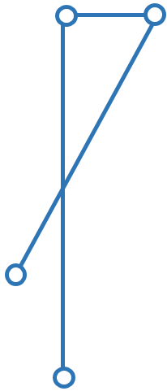 +
`POLYLINE WITH (STRAIGHTS, ARCS) VERTEX LKoord;`
|*Résultat attendu*|
* RPO.T01a.xtf: aucun message d'erreur
|*Référence*|<<1>> Chap. 2.8.12 et 3.3.11.12
|===

====== RPO.T02
[cols="2,5a"]
|===
|ID|RPO.T02

|*Désignation*|*Polylignes : polyligne simple*
|*Description*|Le test doit vérifier la validité d'une polyligne simple ( <<1>> Chap. 2.8.12.2, règle `WITHOUT OVERLAPS` )
|*Condition préalable au test*|
link:https://raw.githubusercontent.com/geoadmin/suite-interlis/master/data/RPO.T02a.xtf[RPO.T02a.xtf],
link:https://raw.githubusercontent.com/geoadmin/suite-interlis/master/data/RPO.T02b.xtf[RPO.T02b.xtf],
link:https://raw.githubusercontent.com/geoadmin/suite-interlis/master/data/RPO.T02c.xtf[RPO.T02c.xtf]
|*Exemple*|image:../img/rpo.t02.png[] +
`POLYLINE WITH (STRAIGHTS, ARCS) VERTEX LKoord WITHOUT OVERLAPS > 1;`
|*Résultat attendu*|
* RPO.T02a.xtf: message d'erreur. La polyligne se recoupe et utilise une même portion de courbe à des multiples reprises
* RPO.T02b.xtf: message d'erreur. La polyligne se recoupe
* RPO.T02c.xtf: aucun message d'erreur
|*Référence*|<<1>> Chap. 2.8.12.2 et 3.3.11.12
|===

====== RPO.T03
[cols="2,5a"]
|===
|ID|RPO.T03

|*Désignation*|*Polylignes : tolérance pour ARC*
|*Description*|Le test doit vérifier la tolérance ( <<1>> Chap. 2.8.12.2, règle `WITHOUT OVERLAPS`)
|*Condition préalable au test*|
link:https://raw.githubusercontent.com/geoadmin/suite-interlis/master/data/RPO.T03a.xtf[RPO.T03a.xtf],
link:https://raw.githubusercontent.com/geoadmin/suite-interlis/master/data/RPO.T03b.xtf[RPO.T03b.xtf]
|*Exemple*| +
`POLYLINE WITH (STRAIGHTS, ARCS) VERTEX LKoord WITHOUT OVERLAPS > 0.10;`
|*Résultat attendu*|
* RPO.T03a.xtf: aucun message d'erreur. La tolérance n’excède pas celle définie dans le modèle de données INTERLIS
* RPO.T03b.xtf: message d'erreur. La tolérance excède celle définie dans le modèle de données INTERLIS
|*Référence*|<<1>> Chap. 2.8.12 et 3.3.11.12
|===

==== Surfaces simples et partitions de territoire
[cols="2,5a"]
|===
|ID|RSU

|*Désignation*|`SURFACE`
|*Description*|Pour la validation des valeurs d'attribut de type `SURFACE`, les règles définies dans <<1>> Chap. 3.3.11.13 s'appliquent
|*Détails*|
* Les valeurs de `SurfaceValue` doivent être conformes à la définition `AttrTypeDef` ( <<1>> Chap. 2.6 et 2.8.12.2 ) du modèle de données INTERLIS
* Pour la validation de la géométrie, les règles définies dans <<1>> Chap. 2.8.12 et 2.8.13 s’appliquent également
* Le règles d'intégrité formulées avec la fonction standard `areAreas` ( <<1>> Chap. 2.12 et 2.14 ) doivent également être validées
|*Référence*|<<1>> Chap. 2.6, 2.8.12, 2.8.12.2, 2.8.13, 2.12, 2.14 et 3.3.11.13
|===

===== Cas de test
====== RSU.T01
[cols="2,5a"]
|===
|ID|RSU.T01

|*Désignation*|*Surfaces simples et partitions de territoire :* `AREA`
|*Description*|Le test doit vérifier si deux polygones sont conformes à la définition `AREA`
|*Condition préalable au test*|
link:https://raw.githubusercontent.com/geoadmin/suite-interlis/master/data/RSU.T01a.xtf[RSU.T01a.xtf],
link:https://raw.githubusercontent.com/geoadmin/suite-interlis/master/data/RSU.T01b.xtf[RSU.T01b.xtf],
link:https://raw.githubusercontent.com/geoadmin/suite-interlis/master/data/RSU.T01c.xtf[RSU.T01c.xtf]
|*Exemple*|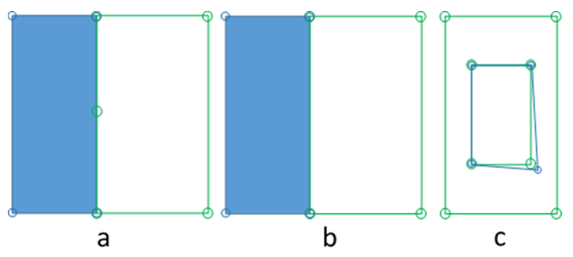
|*Résultat attendu*|
* RSU.T01a.xtf: message d'erreur. Les surfaces ne partagent pas les mêmes portions de courbe (une surface contient un point d'appui supplémentaire)
* RSU.T01b.xtf: aucun message d'erreur
* RSU.T01c.xtf: message d'erreur. Les surfaces ne partagent pas les mêmes portions de courbe
|*Référence*|<<1>> Chap. 2.8.13 et 3.3.11.13
|===

====== RSU.T02
[cols="2,5a"]
|===
|ID|RSU.T02

|*Désignation*|*Surfaces simples et partitions de territoire : validité des géométries*
|*Description*|Le test doit vérifier la validité des géométries
|*Condition préalable au test*|
link:https://raw.githubusercontent.com/geoadmin/suite-interlis/master/data/RSU.T02a.xtf[RSU.T02a.xtf] (`AREA`),
link:https://raw.githubusercontent.com/geoadmin/suite-interlis/master/data/RSU.T02b.xtf[RSU.T02b.xtf] (`SURFACE`)
|*Exemple*|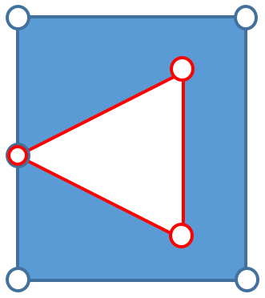
|*Résultat attendu*|
* RSU.T02a.xtf: aucun message d'erreur
* RSU.T02b.xtf: aucun message d'erreur
|*Référence*|<<1>> Chap. 2.8.13 et 3.3.11.13
|===

====== RSU.T03
[cols="2,5a"]
|===
|ID|RSU.T03

|*Désignation*|*Surfaces simples et partitions de territoire : validité des géométries*
|*Description*|Le test doit vérifier la validité des géométries
|*Condition préalable au test*|
link:https://raw.githubusercontent.com/geoadmin/suite-interlis/master/data/RSU.T03a.xtf[RSU.T03a.xtf] (`AREA`),
link:https://raw.githubusercontent.com/geoadmin/suite-interlis/master/data/RSU.T03b.xtf[RSU.T03b.xtf] (`SURFACE`)
|*Exemple*|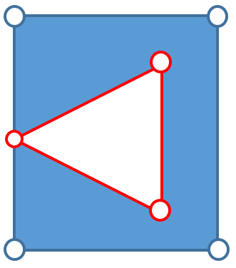
|*Résultat attendu*|
* RSU.T03a.xtf: message d'erreur. _OuterBoundary_ et _InnerBoundary_ ne correspondent pas
* RSU.T03b.xtf: message d'erreur. _OuterBoundary_ et _InnerBoundary_ ne correspondent pas
|===

====== RSU.T04
[cols="2,5a"]
|===
|ID|RSU.T04

|*Désignation*|*Surfaces simples et partitions de territoire : validité des géométries*
|*Description*|Le test doit vérifier la validité des géométries
|*Condition préalable au test*|
link:https://raw.githubusercontent.com/geoadmin/suite-interlis/master/data/RSU.T04a.xtf[RSU.T04a.xtf] (`AREA`),
link:https://raw.githubusercontent.com/geoadmin/suite-interlis/master/data/RSU.T04b.xtf[RSU.T04b.xtf] (`SURFACE`)
|*Exemple*|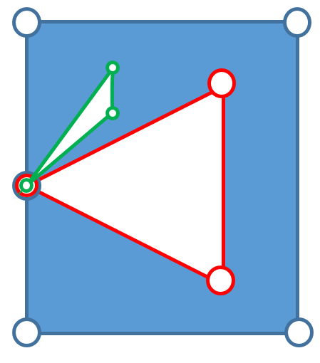
|*Résultat attendu*|
* RSU.T04a.xtf: aucun message d'erreur
* RSU.T04b.xtf: aucun message d'erreur
|*Référence*|<<1>> Chap. 2.8.13 et 3.3.11.13
|===

====== RSU.T05
[cols="2,5a"]
|===
|ID|RSU.T05

|*Désignation*|*Surfaces simples et partitions de territoire : validité des géométries*
|*Description*|Le test doit vérifier la validité des géométries
|*Condition préalable au test*|
link:https://raw.githubusercontent.com/geoadmin/suite-interlis/master/data/RSU.T05a.xtf[RSU.T05a.xtf] (`AREA`),
link:https://raw.githubusercontent.com/geoadmin/suite-interlis/master/data/RSU.T05b.xtf[RSU.T05b.xtf] (`SURFACE`)
|*Exemple*|
|*Résultat attendu*|
* RSU.T05a.xtf: aucun message d'erreur
* RSU.T05b.xtf: aucun message d'erreur
|*Référence*|<<1>> Chap. 2.8.13 et 3.3.11.13
|===

====== RSU.T06
[cols="2,5a"]
|===
|ID|RSU.T06

|*Désignation*|*Surfaces simples et partitions de territoire : validité des géométries*
|*Description*|Le test doit vérifier la validité des géométries
|*Condition préalable au test*|
link:https://raw.githubusercontent.com/geoadmin/suite-interlis/master/data/RSU.T06a.xtf[RSU.T06a.xtf] (`AREA`),
link:https://raw.githubusercontent.com/geoadmin/suite-interlis/master/data/RSU.T06b.xtf[RSU.T06b.xtf] (`SURFACE`)
|*Exemple*|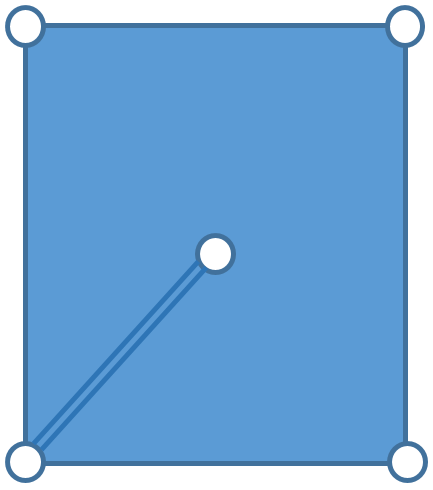
|*Résultat attendu*|
* RSU.T06a.xtf: message d'erreur. Géométrie non valide
* RSU.T06b.xtf: message d'erreur. Géométrie non valide
|*Référence*|<<1>> Chap. 2.8.13 et 3.3.11.13
|===

====== RSU.T07
[cols="2,5a"]
|===
|ID|RSU.T07

|*Désignation*|*Surfaces simples et partitions de territoire : validité des géométries*
|*Description*|Le test doit vérifier la validité des géométries
|*Condition préalable au test*|
link:https://raw.githubusercontent.com/geoadmin/suite-interlis/master/data/RSU.T07a.xtf[RSU.T07a.xtf] (`AREA`),
link:https://raw.githubusercontent.com/geoadmin/suite-interlis/master/data/RSU.T07b.xtf[RSU.T07b.xtf] (`SURFACE`)
|*Exemple*|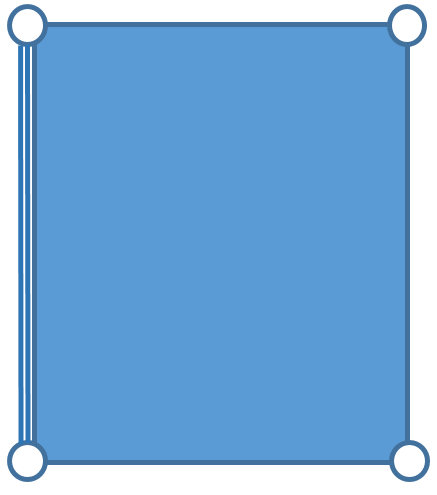
|*Résultat attendu*|
* RSU.T07a.xtf: message d'erreur. Géométrie non valide
* RSU.T07b.xtf: message d'erreur. Géométrie non valide
|*Référence*|<<1>> Chap. 2.8.13 et 3.3.11.13
|===

====== RSU.T08
[cols="2,5a"]
|===
|ID|RSU.T08

|*Désignation*|*Surfaces simples et partitions de territoire : validité des géométries*
|*Description*|Le test doit vérifier la validité des géométries
|*Condition préalable au test*|
link:https://raw.githubusercontent.com/geoadmin/suite-interlis/master/data/RSU.T08a.xtf[RSU.T08a.xtf] (`AREA`),
link:https://raw.githubusercontent.com/geoadmin/suite-interlis/master/data/RSU.T08b.xtf[RSU.T08b.xtf] (`SURFACE`)
|*Exemple*|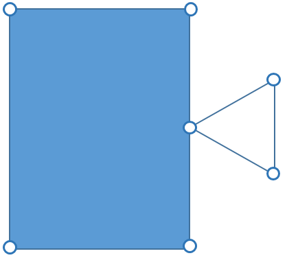
|*Résultat attendu*|
* RSU.T08a.xtf: message d'erreur. _InnerBoundary_ doit être à l’intérieur de _OuterBoundary_
* RSU.T08b.xtf: message d'erreur. _InnerBoundary_ doit être à l’intérieur de _OuterBoundary_
|*Référence*|<<1>> Chap. 2.8.13 et 3.3.11.13
|===

====== RSU.T09
[cols="2,5a"]
|===
|ID|RSU.T09

|*Désignation*|*Surfaces simples et partitions de territoire : validité des géométries*
|*Description*|Le test doit vérifier la validité des géométries
|*Condition préalable au test*|
link:https://raw.githubusercontent.com/geoadmin/suite-interlis/master/data/RSU.T09a.xtf[RSU.T09a.xtf] (`AREA`),
link:https://raw.githubusercontent.com/geoadmin/suite-interlis/master/data/RSU.T09b.xtf[RSU.T09b.xtf] (`SURFACE`)
|*Exemple*|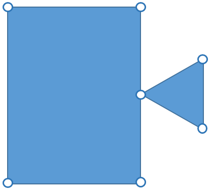
|*Résultat attendu*|
* RSU.T09a.xtf: message d'erreur. Multipolygon
* RSU.T09b.xtf: message d'erreur. Multipolygon
|*Référence*|<<1>> Chap. 2.8.13 et 3.3.11.13
|===

====== RSU.T10
[cols="2,5a"]
|===
|ID|RSU.T10

|*Désignation*|*Surfaces simples et partitions de territoire : validité des géométries*
|*Description*|Le test doit vérifier la validité des géométries
|*Condition préalable au test*|
link:https://raw.githubusercontent.com/geoadmin/suite-interlis/master/data/RSU.T10a.xtf[RSU.T10a.xtf] (`AREA`),
link:https://raw.githubusercontent.com/geoadmin/suite-interlis/master/data/RSU.T10b.xtf[RSU.T10b.xtf] (`SURFACE`)
|*Exemple*|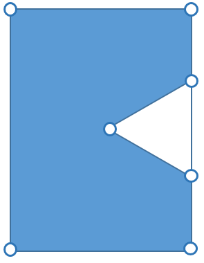
|*Résultat attendu*|
* RSU.T10a.xtf: message d'erreur. Géométrie non valide
* RSU.T10b.xtf: message d'erreur. Géométrie non valide
|*Référence*|<<1>> Chap. 2.8.13 et 3.3.11.13
|===

====== RSU.T11
[cols="2,5a"]
|===
|ID|RSU.T11

|*Désignation*|*Surfaces simples et partitions de territoire : validité des géométries*
|*Description*|Le test doit vérifier la validité des géométries
|*Condition préalable au test*|
link:https://raw.githubusercontent.com/geoadmin/suite-interlis/master/data/RSU.T011.xtf[RSU.T11a.xtf] (`AREA`),
link:https://raw.githubusercontent.com/geoadmin/suite-interlis/master/data/RSU.T011.xtf[RSU.T011.xtf] (`SURFACE`)
|*Exemple*|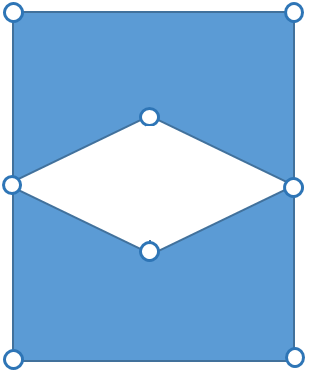
|*Résultat attendu*|
* RSU.T11a.xtf: message d'erreur. Géométrie non valide
* RSU.T11b.xtf: message d'erreur. Géométrie non valide
|*Référence*|<<1>> Chap. 2.8.13 et 3.3.11.13
|===

====== RSU.T12
[cols="2,5a"]
|===
|ID|RSU.T12

|*Désignation*|*Surfaces simples et partitions de territoire : validité des géométries*
|*Description*|Le test doit vérifier la validité des géométries
|*Condition préalable au test*|
link:https://raw.githubusercontent.com/geoadmin/suite-interlis/master/data/RSU.T12a.xtf[RSU.T12a.xtf] (`AREA`),
link:https://raw.githubusercontent.com/geoadmin/suite-interlis/master/data/RSU.T12b.xtf[RSU.T12b.xtf] (`SURFACE`)
|*Exemple*|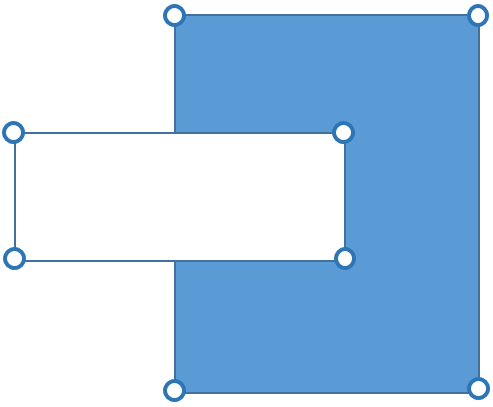
|*Résultat attendu*|
* RSU.T12a.xtf: message d'erreur. Géométrie non valide
* RSU.T12b.xtf: message d'erreur. Géométrie non valide
|*Référence*|<<1>> Chap. 2.8.13 et 3.3.11.13
|===

====== RSU.T13
[cols="2,5a"]
|===
|ID|RSU.T13

|*Désignation*|*Surfaces simples et partitions de territoire : validité des géométries*
|*Description*|Le test doit vérifier la validité des géométries
|*Condition préalable au test*|
link:https://raw.githubusercontent.com/geoadmin/suite-interlis/master/data/RSU.T13a.xtf[RSU.T13a.xtf] (`AREA`),
link:https://raw.githubusercontent.com/geoadmin/suite-interlis/master/data/RSU.T13b.xtf[RSU.T13b.xtf] (`SURFACE`)
|*Exemple*|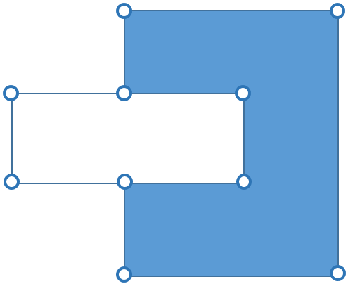
|*Résultat attendu*|
* RSU.T13a.xtf: message d'erreur. Géométrie non valide
* RSU.T13b.xtf: message d'erreur. Géométrie non valide
|*Référence*|<<1>> Chap. 2.8.13 et 3.3.11.13
|===

==== Cardinalité
[cols="2,5a"]
|===
|ID|RKA

|*Désignation*|*Cardinalité des attributs*
|*Description*|Pour la validation de la cardinalité, le nombre des objets nécessaires / permis doit être conforme à la définition `AttrTypeDef` ( <<1>> Chap. 2.6.1 ) du modèle de données INTERLIS
|*Détails*|
* ELes règles définies dans <<1>> Chap. 2.7.3 s'appliquent également
|*Référence*| <<1>> Chap. 2.6.1 et 2.7.3
|===

===== Cas de test
====== RKA.T01
[cols="2,5a"]
|===
|ID|RKA.T01

|*Désignation*|*Cardinalité :* `MANDATORY`
|*Description*|Le test doit vérifier les règles de cardinalité des attributs
|*Condition préalable au test*|
link:https://raw.githubusercontent.com/geoadmin/suite-interlis/master/data/RKA.T01a.xtf[RKA.T01a.xtf],
link:https://raw.githubusercontent.com/geoadmin/suite-interlis/master/data/RKA.T01b.xtf[RKA.T01b.xtf]
|*Résultat attendu*|
* RKA.T01a.xtf: aucun message d'erreur
* RKA.T01b.xtf: message d'erreur. Attribut obligatoire manquant
|*Référence*|<<1>> Chap. 2.6.1 et 2.7.3
|===

====== RKA.T02
[cols="2,5a"]
|===
|ID|RKA.T02

|*Désignation*|*Cardinalité :* `BAG OF`
|*Description*|Le test doit vérifier les règles de cardinalité des attributs
|*Condition préalable au test*|
link:https://raw.githubusercontent.com/geoadmin/suite-interlis/master/data/RKA.T02a.xtf[RKA.T02a.xtf],
link:https://raw.githubusercontent.com/geoadmin/suite-interlis/master/data/RKA.T02b.xtf[RKA.T02b.xtf],
link:https://raw.githubusercontent.com/geoadmin/suite-interlis/master/data/RKA.T02c.xtf[RKA.T02c.xtf],
link:https://raw.githubusercontent.com/geoadmin/suite-interlis/master/data/RKA.T02d.xtf[RKA.T02d.xtf]
|*Résultat attendu*|
* RKA.T02a.xtf: aucun message d'erreur
* RKA.T02b.xtf: message d'erreur. Attribut obligatoire manquant
* RKA.T02c.xtf: message d'erreur. La structure ne doit pas apparaître plus de deux fois
* RKA.T02d.xtf: message d'erreur. Codage incorrect ( balises `Namen` multiples )
|*Référence*|<<1>> Chap. 2.6.1 et 2.7.3
|===
