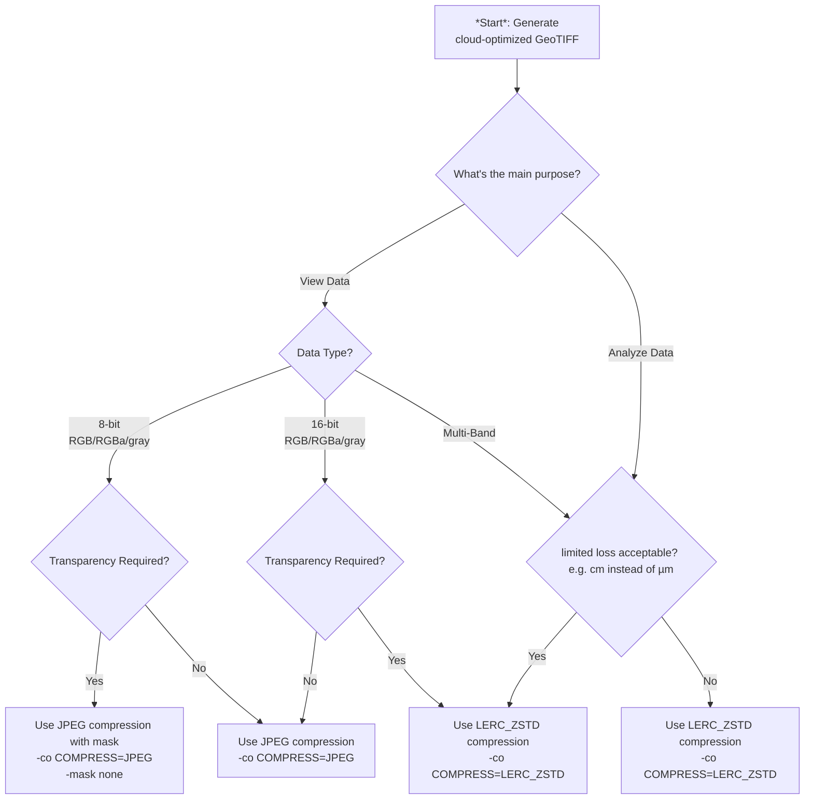

# About
This document summarizes **best practices for creating COG (Cloud Optimized GeoTIFF) files based on various use cases.**

# Choose your case



# Raster
Apply the optimization steps according to the use case and publish cloud-optimized GeoTIFF [COG](https://cogeo.org) using a recent version of [gdal](https://gdal.org). Windows users may use the OSGeo4WShell provided by [QGIS](https://qgis.org).

## lossless raster

Apply optimization steps for raster data
1. prepare input data at a reasonable precision (i.e. `cm` instead of `µm` or `nm` i.e. in the data source)
2. compress your data using
    ```
    gdal_translate -a_srs EPSG:2056 -of COG -co COMPRESS=LERC_ZSTD -co LEVEL=22 -co NUM_THREADS=ALL_CPUS -co BIGTIFF=YES -co STATISTICS=YES ... -ot <datatype> <input.tif> <output.tif>
    ```
    while
    - choosing the appropriate scale and offset for the data if feasible (i.e. scale `cm` instead of `m` using [-a_scale](https://gdal.org/en/stable/programs/gdal_translate.html#cmdoption-gdal_translate-a_scale)) and / or offset (using [-a_offset](https://gdal.org/en/stable/programs/gdal_translate.html#cmdoption-gdal_translate-a_offset)) to better fit the numbers
      - rescaling the data on the fly if not preprocessed already using [-scale](https://gdal.org/en/stable/programs/gdal_translate.html#cmdoption-gdal_translate-scale)
    - choosing to the most appropriate data type ([Byte/Int8/Int16/UInt16/UInt32/Int32/Float32](https://gdal.org/en/stable/programs/gdal_translate.html#cmdoption-gdal_translate-ot)) using the least amount of bits possible.

#### _Notes on `LERC_ZSTD` (lossy/lossless) compression_
- _`MAX_Z_ERROR` defaults to `0` (lossless)_
- _supported since [GDAL](https://gdal.org) v2.4+_ thus also in QGIS, etc.
- _supported by [geotiff.js](https://geotiffjs.github.io/) v2.1+_ thus also in openlayers, etc.
- _has been [developed and published by ESRI](https://github.com/esri/lerc/) and is supported in their products_
- _supported in STAC-browser v3.4_

## lossy visual image

1. compress your data using
    ```
    gdal_translate -a_srs EPSG:2056 -of COG -co COMPRESS=JPEG -co NUM_THREADS=ALL_CPUS -co BIGTIFF=YES -co STATISTICS=YES -co QUALITY=70 ... <input.tif> <output.tif>
    ```

## lossy numerical raster

1. compress your data using
    ```
    gdal_translate -a_srs EPSG:2056 -of COG -co COMPRESS=LERC_ZSTD -co LEVEL=22 -co NUM_THREADS=ALL_CPUS -co BIGTIFF=YES -co STATISTICS=YES -co MAX_Z_ERROR=<threshold> ... -ot <datatype> <input.tif> <output.tif>
    ```
    while
    - choosing a [threshold](https://gdal.org/en/stable/drivers/raster/cog.html#general-creation-options:~:text=MAX_Z_ERROR) (limited error tolerance i.e. `0.01` for `cm`) for better lossy compression ratio
  
# Table of Contents
<details open>
<summary><b>(click to expand or hide)</b></summary>
<!-- MarkdownTOC -->

1. [All of my Wifi adapter repos:](#all-of-my-wifi-adapter-repos)
1. [Wiki Instructions](#wiki-instructions)
1. [My Instructions](#my-instructions)
1. [Alfa Driver DVDs](#alfa-driver-dvds)
    1. [Disk 1: ALFA_Driver_DVD_old](#disk-1-alfa_driver_dvd_old)
    1. [Disk 2: ALFA_Driver_DVD_v3.0](#recommended)
    1. [Disk copy instructions on Linux](#disk-copy-instructions-on-linux)
1. [License](#license)
1. [Driver Installation Instructions on Linux](#driver-installation-instructions-on-linux)
    1. [1. Alfa AWUS036NH 2000mW Tx Power 2.4GHz USB Wi-Fi adapter](#1-alfa-awus036nh-2000mw-tx-power-24ghz-usb-wi-fi-adapter)
        1. [SPEED:](#speed)
        1. [INSTALL DRIVER:](#install-driver)
        1. [CONNECT AND CONFIGURE:](#connect-and-configure)
    1. [2. Alfa AWUS036AC 802.11ac Long Range AC1200 Dual Band 2.4GHz/5GHz WiFi USB adapter](#2-alfa-awus036ac-80211ac-long-range-ac1200-dual-band-24ghz5ghz-wifi-usb-adapter)
        1. [SPEED:](#speed-1)
        1. [INSTALL DRIVER:](#install-driver-1)
        1. [CONNECT AND CONFIGURE:](#connect-and-configure-1)

<!-- /MarkdownTOC -->
</details>
