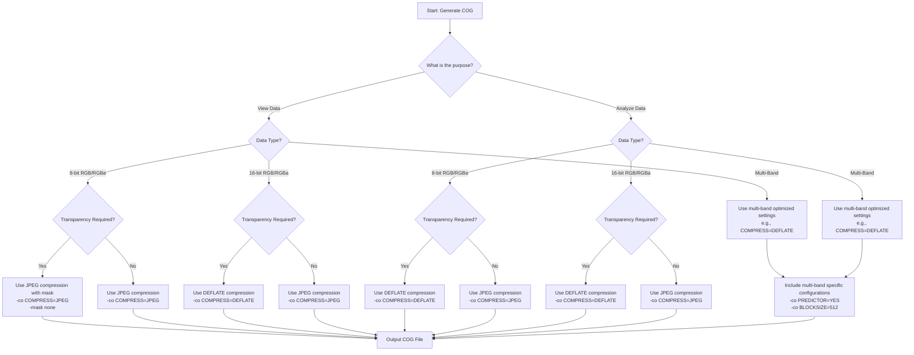

```mermaid
flowchart TD
  A[Start: Generate COG] --> B{What is the purpose?}
  B -->|View Data| C{Data Type?}
  B -->|Analyze Data| D{Data Type?}
  C -->|8-bit RGB/RGBa| E{Transparency Required?}
  C -->|16-bit RGB/RGBa| F{Transparency Required?}
  C -->|Multi-Band| G[Use multi-band optimized settings<br>e.g., COMPRESS=DEFLATE]
  D -->|8-bit RGB/RGBa| H{Transparency Required?}
  D -->|16-bit RGB/RGBa| I{Transparency Required?}
  D -->|Multi-Band| J[Use multi-band optimized settings<br>e.g., COMPRESS=DEFLATE]
  E -->|Yes| K[Use JPEG compression with mask<br>-co COMPRESS=JPEG<br>-mask none]
  E -->|No| L[Use JPEG compression<br>-co COMPRESS=JPEG]
  F -->|Yes| M[Use DEFLATE compression<br>-co COMPRESS=DEFLATE]
  F -->|No| N[Use JPEG compression<br>-co COMPRESS=JPEG]
  H -->|Yes| O[Use DEFLATE compression<br>-co COMPRESS=DEFLATE]
  H -->|No| P[Use JPEG compression<br>-co COMPRESS=JPEG]
  I -->|Yes| Q[Use DEFLATE compression<br>-co COMPRESS=DEFLATE]
  I -->|No| R[Use JPEG compression<br>-co COMPRESS=JPEG]
  G & J --> S[Include multi-band specific configurations<br>-co PREDICTOR=YES<br>-co BLOCKSIZE=512]
  K & L & M & N & O & P & Q & R & S --> T[Output COG File]
  click E "https://gdal.org/drivers/raster/cog.html" "Details on Transparency with JPEG"
  click F "https://gdal.org/drivers/raster/cog.html" "Details on Transparency with DEFLATE"
  click G "https://gdal.org/drivers/raster/cog.html" "Multi-Band Compression Details"
  click J "https://gdal.org/drivers/raster/cog.html" "Multi-Band Compression Details"
  click T "https://gdal.org/drivers/raster/cog.html" "GDAL Documentation"
```
